# Exam App

<p align="center">
  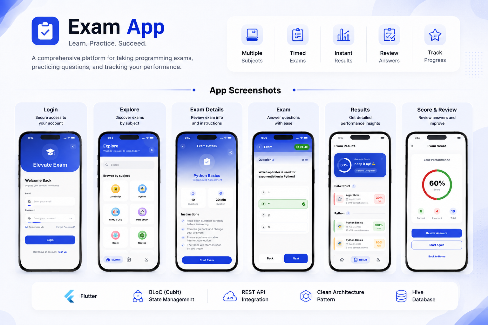
</p>

A Flutter-based mobile application that enables users to practice exams across different subjects, track their performance, and review previous attempts through a clean and interactive user experience.

## Features

- Secure Authentication
  - Login
  - Register
  - Forgot Password

- Explore exams from multiple subjects.

- Take timed multiple-choice exams.

- Review your answers after finishing each exam.

- View detailed exam results, including:
  - Score
  - Percentage
  - Pass/Fail status
  - Number of correct answers

- Track your performance in every subject separately.

- View previous exam attempts and their results.

- User profile management.

- Responsive and modern UI.

- Clean Architecture with feature-based structure.

- State Management using BLoC (Cubit).

- REST API integration using Dio & Retrofit.

---

## Tech Stack

- Flutter
- Dart
- BLoC (Cubit)
- Dio
- Retrofit
- Injectable
- GetIt
- Flutter Secure Storage

---

## Project Structure

```text
lib
├── config
├── core
├── feature
│   ├── auth
│   ├── exam
│   ├── explore
│   ├── profile
│   ├── results
│   └── ...
└── main.dart
```

---

## Screenshots

### Authentication

<p align="center">
  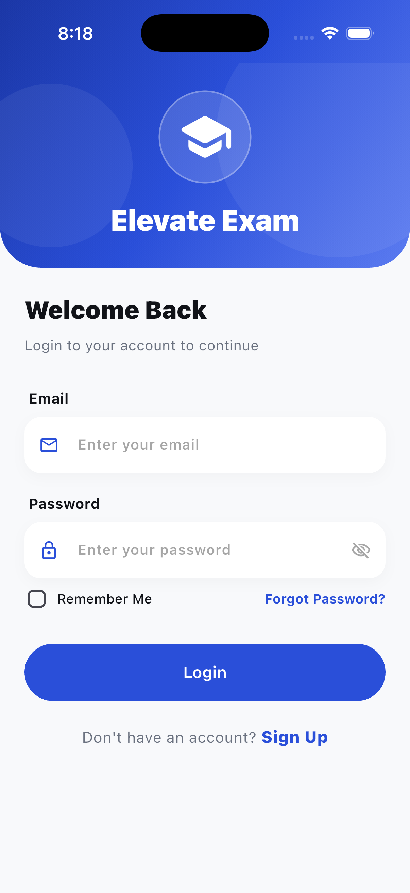
  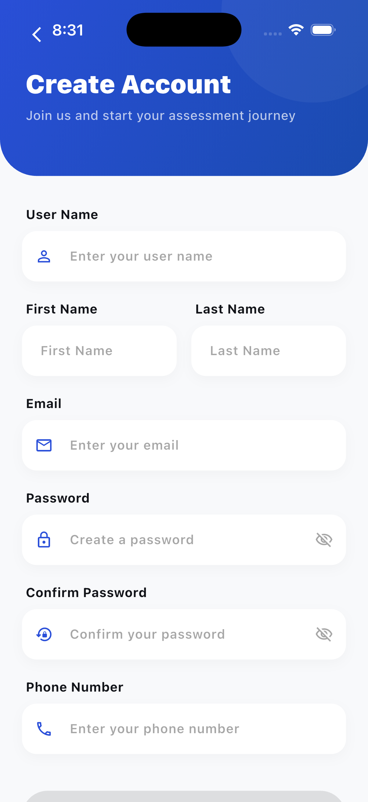
</p>

### Home

<p align="center">
  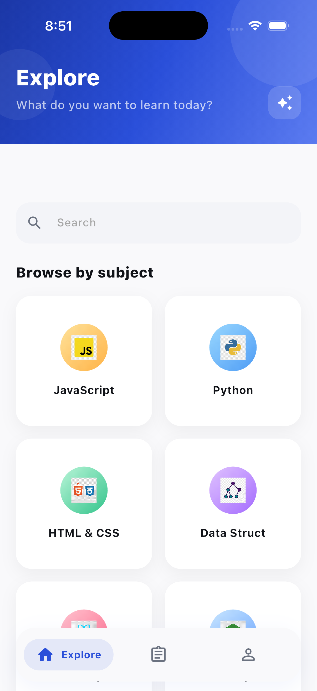
  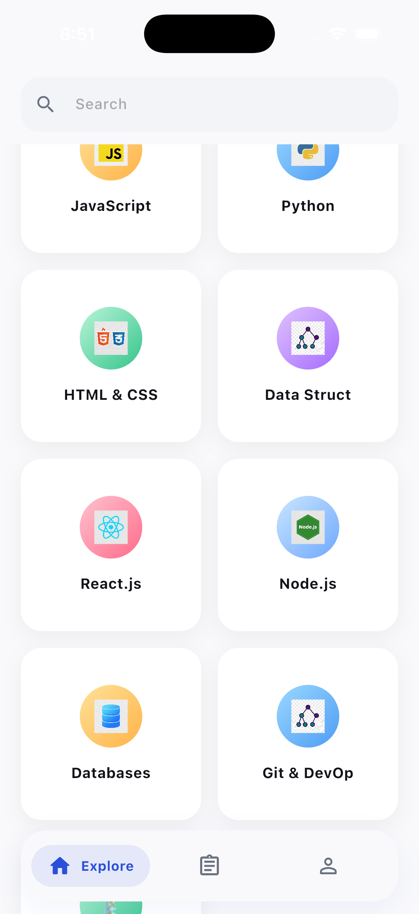
</p>

### Exam

<p align="center">
  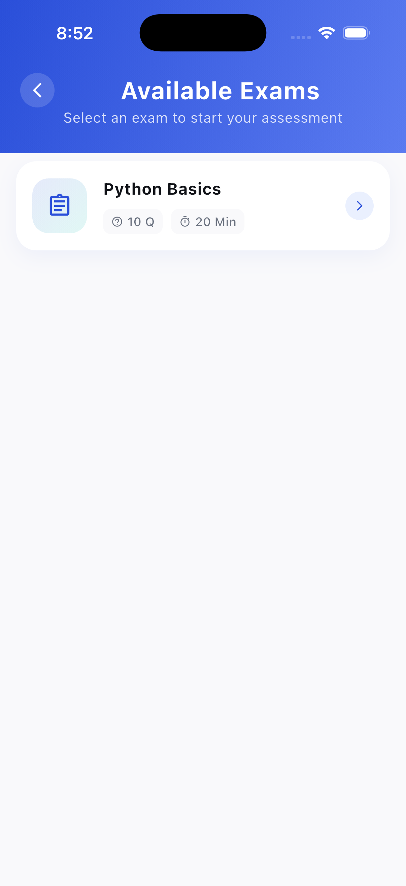
  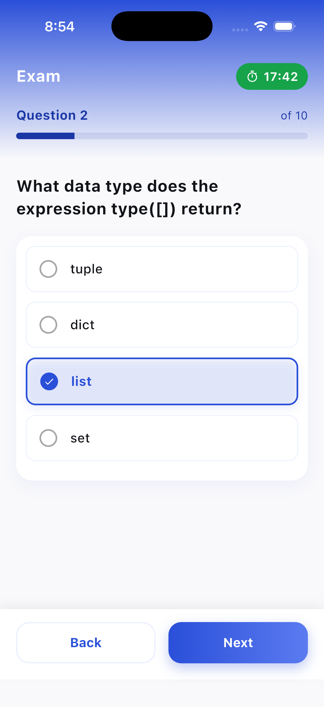
  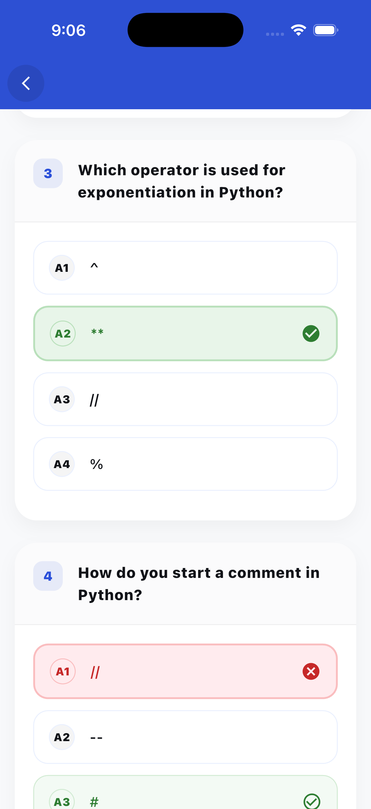
</p>

### Exam Details

<p align="center">
  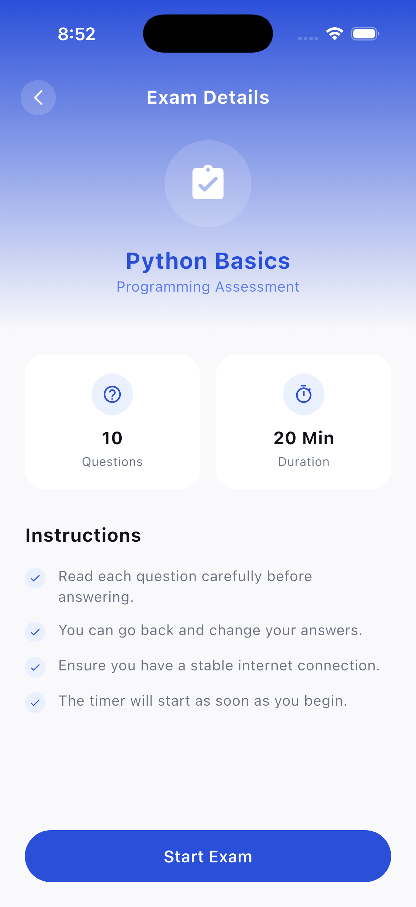
</p>

### Scores

<p align="center">
  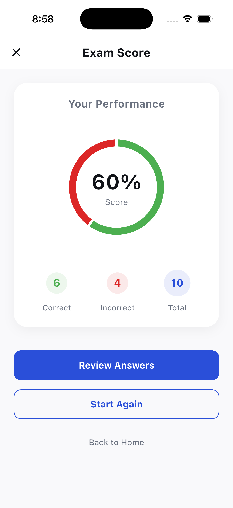
  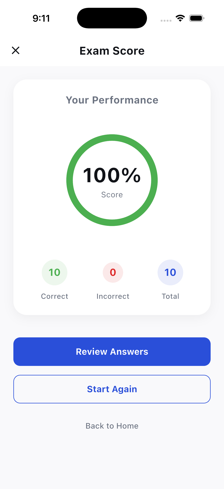
</p>

### Results

<p align="center">
  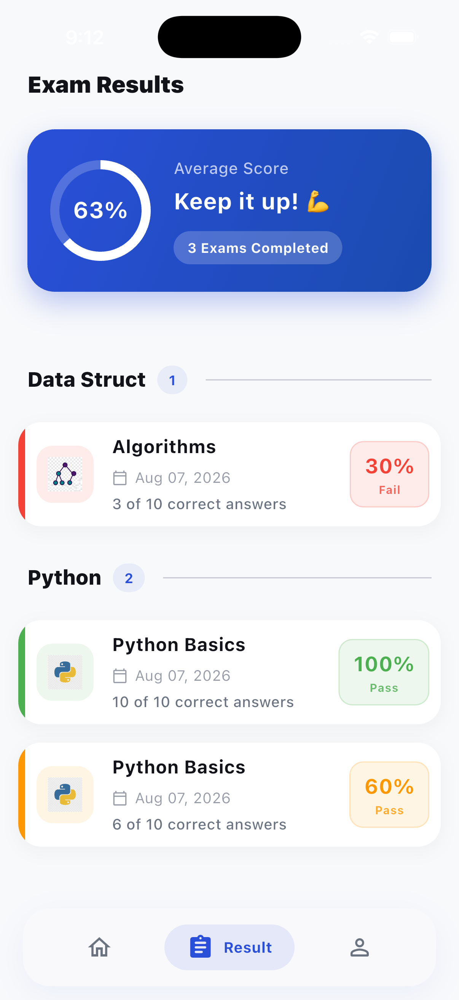
</p>

### Profile

<p align="center">
  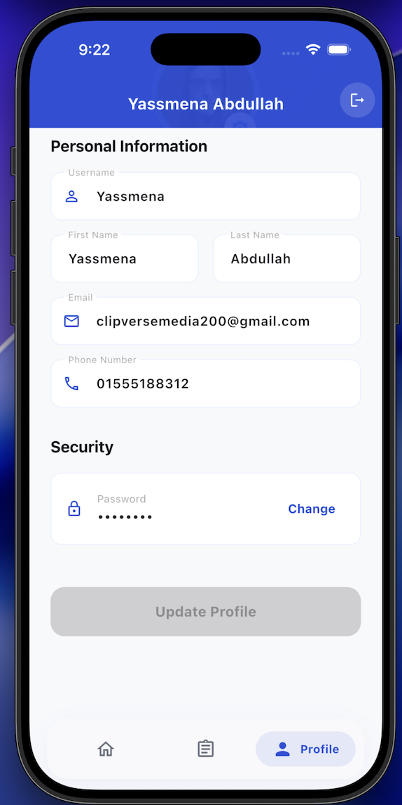
</p>

---

## Getting Started

Clone the repository

```bash
git https://github.com/NourMohamed905/Exam.git
```

Install dependencies

```bash
flutter pub get
```

Run the application

```bash
flutter run
```

---

## Architecture

This project follows **Clean Architecture** with feature-based modularization.

```
Presentation
      ↓
   Domain
      ↓
     Data
      ↓
      API
```